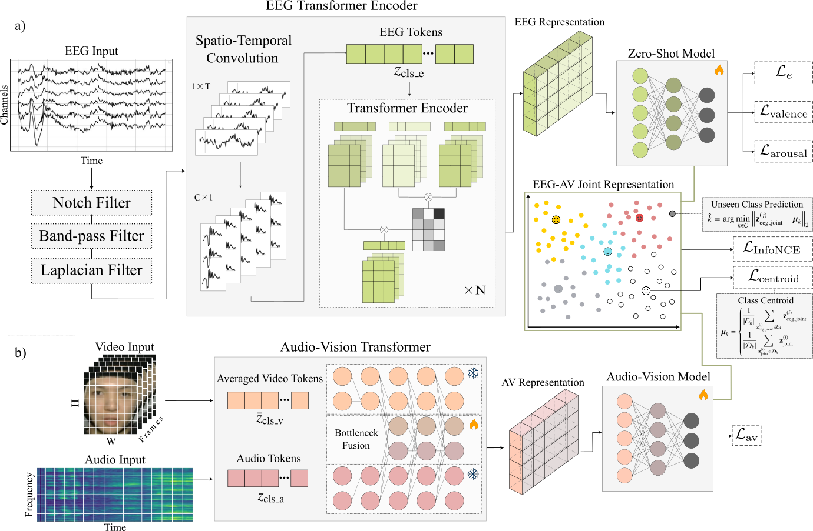
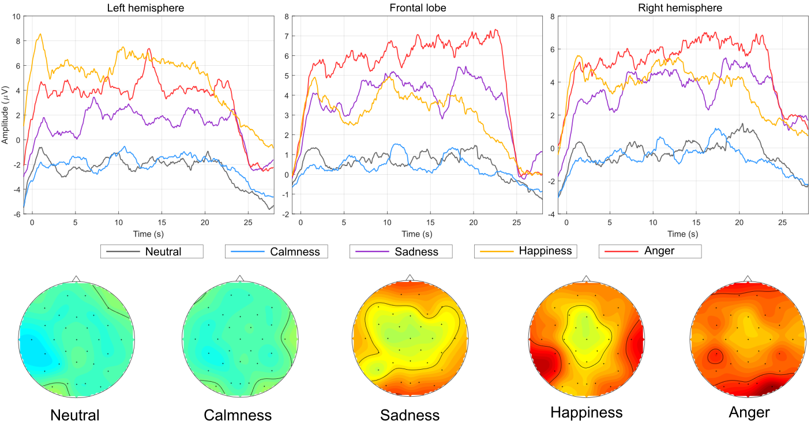

# HumanEmotionRecognition: Multimodal BCI System

**A commercial-grade Brain-Computer Interface (BCI) solution for emotion recognition using EEG, Audio, and Video data.**

## 📌 Overview

This software provides a modular AI framework for recognizing human emotional states (**Neutral, Sadness, Anger, Happiness, Calmness**). It leverages a novel **Cross-Modal Bottleneck Fusion** architecture to integrate physiological signals (EEG) with audiovisual cues, enabling high-accuracy emotion detection even in **Zero-Shot** scenarios.

This technology is designed for integration into:
- Medical Rehabilitation Centers
- Interactive Digital Healthcare Systems
- Neuromarketing & User Experience Analytics

<p align="center">
  
</p>

> **Figure 1.** Multimodal ZSL for EEG emotion recognition: EEG is encoded by an EEG Transformer, while audio–video features are fused via bottleneck AV Transformer. Both embeddings are aligned in a shared semantic space for unseen-class prediction using centroid-based inference.

<p align="center">
  
</p>

> **Figure 2.** Beta-band EEG patterns across emotions. Averaged 11–20 Hz envelope power over time (20 s speaking task) is shown for five emotions across left hemisphere, frontal lobe, and right hemisphere; topographic maps below illustrate emotion-specific spatial EEG distributions.


## 🚀 Key Features

- **Multimodal Fusion:** Synchronizes EEG, Audio, and Video streams using a Transformer-based architecture.
- **Zero-Shot Learning:** Recognizes emotional states without subject-specific calibration.
- **Modular Design:** Independent processing blocks for easy integration into existing hospital systems.

## 🛠️ Installation

1. **Clone the repository**
   ```bash
   git clone https://github.com/minholee2087/BCI_software.git
   cd HumanEmotionRecognition
   ``` 

2. **Install dependencies**

   ```bash
   pip install -r requirements.txt
   ```

3. **Download the dataset**

   The system requires the **Global Multimodal BCI Dataset**. Run the following command to download it automatically:

   ```bash
   python main.py --mode download
   ```

## ▶️ Usage

The system operates via a command-line interface (CLI) for robust automation.

### 1) Run Full Training (All Classes)

Train the model on all 5 emotion classes:

```bash
python main.py --mode train_all
```

### 2) Run Zero-Shot Experiment

Test the model’s ability to recognize a specific emotion (e.g., Happiness) without prior training on that specific class:

```bash
python main.py --mode zeroshot --class_label 3
```

Class labels:

* `0` = Neutral
* `1` = Sadness
* `2` = Anger
* `3` = Happiness
* `4` = Calmness

## 🧠 Architecture

The system utilizes a **Cross-Modal Bottleneck Fusion Transformer**.

* **Inputs:** EEG signals, Audio spectrograms, Video frames
* **Encoders:** Independent Transformer backbones for each modality
* **Fusion:** A shared bottleneck mechanism enables efficient information exchange across modalities before classification

## 📄 License

This project is licensed under the MIT License — see the `LICENSE` file for details.

## 🙏 Acknowledgments

Supported by the Health and Medical Technology R&D Program and developed in collaboration with Nazarbayev University and DGMIF.


