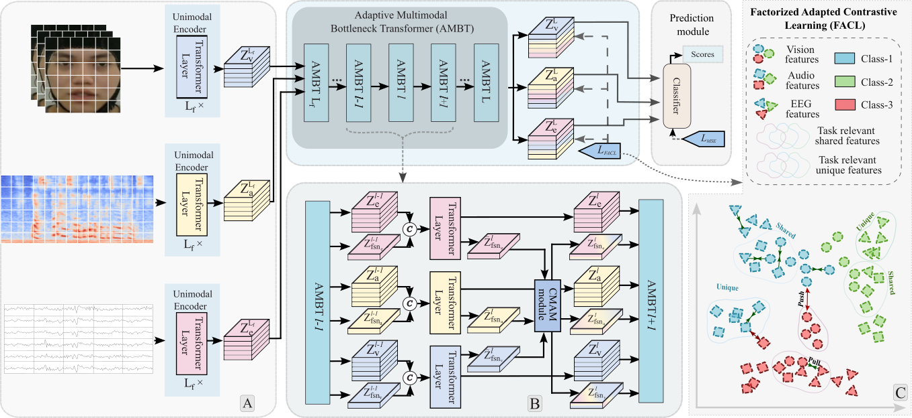
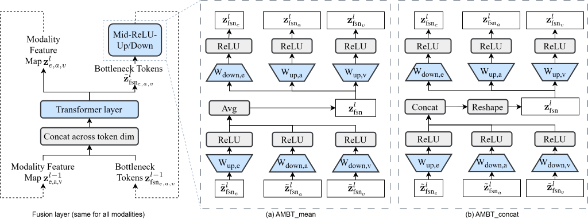

# Adaptive Multimodal Bottleneck Transformer (AMBT)


**Adaptive Multimodal EEG–Audio–Video Fusion Transformer for Emotion Recognition**

This repository provides the official implementation of **AMBT (Adaptive Multimodal Bottleneck Transformer)** — a **parameter-efficient multimodal Transformer** for **brain–computer interface (BCI)** emotion recognition, designed to fuse **EEG**, **speech audio**, and **facial video** via **adaptive bottleneck-token interaction** inside intermediate Transformer layers.

> 📌 This software is developed as a research and commercialization deliverable of the grant project:
> **“Development of Brain–Computer Interface (BCI) SW/HW Solutions”** (Commercialization Projects Funding)
---

## ✨ Overview

Emotion recognition in conversational settings requires robust multimodal understanding. Facial and speech expressions are strong external cues, while **EEG provides complementary neural evidence**, especially when external signals are ambiguous or missing.

However, integrating heterogeneous modalities remains challenging due to:

* different sampling rates (EEG vs audio vs video),
* different feature spaces,
* different backbone architectures and tokenization methods.

**AMBT** addresses these challenges by introducing **Cross-Modal Adaptation Modules (CMAMs)** that enable **controlled cross-modal interaction** through **bottleneck tokens**, inserted into intermediate layers of modality-specific Transformer encoders.

---

## 🧠 Key Ideas

AMBT performs fusion using **adapter-style bottleneck interaction**:

- **Stable fusion** through bottleneck tokens (reduces premature collapse)
- **Preserves unimodal capacity** while enriching representations with cross-modal context
- **Architecture-agnostic integration** across heterogeneous Transformer encoders
- **Parameter-efficient training** (**< 1%** additional trainable parameters)

---

## 🏗️ Method

### Adaptive Multimodal Bottleneck Transformer (AMBT)

CMAM injects multimodal interaction into intermediate Transformer layers using bottleneck tokens shared across modalities.

<p align="center">
  
</p>

> **Figure 1.** Overview of AMBT: unimodal encoders + CMAM adapters with bottleneck tokens enabling cross-modal exchange.

---

### Bottleneck Token Interaction

<p align="center">
  
</p>

> **Figure 2.** CMAM block: bottleneck tokens interact with modality-specific tokens and propagate fused context.

---

## 📊 Results

Evaluated on three benchmark datasets:

| Dataset | Modalities | Accuracy |
|--------|------------|----------|
| **EAV** | EEG + Audio + Video | **85.1%** |
| **CREMA-D** | Audio + Video | **90.9%** |
| **DEAP** | EEG + Video | **98.7%** |

---

## 🔥 Software Features

* Independent Transformer encoders for **EEG**, **audio**, and **video**
* **CMAM** modules for controlled bottleneck-token fusion
* Parameter-efficient multimodal adaptation (**< 1% trainable params**)
* Unified latent space for fused multimodal representations
* Supported modalities and formats:

  * EEG (DEAP / EAV format)
  * Audio spectrograms (CREMA-D / EAV)
  * Facial video (CREMA-D / DEAP / EAV)
* Modular research codebase:

  * `src/models/` – unimodal + fusion models
  * `src/datasets/` – dataset loaders
  * `src/training/` – training & evaluation scripts
  * `src/utils/` – config, logging, metrics, checkpointing, seeding

---

## ⚙️ Installation

### Windows

Run:

```bash
install.bat
```

This will:

* Verify Python **3.8+** is installed
* Create a virtual environment (`venv/`)
* Install dependencies from `requirements.txt`

---

## ⚙️ Installation

### Windows (Recommended)

Run:

```bash
install.bat
```

This will:

* verify Python **3.8+** is installed
* create a virtual environment (`venv/`)
* install dependencies from `requirements.txt`

---

## 🚀 Usage

Run the training pipeline:

```bash
run.bat
```

This script will:

* check that the virtual environment (`venv/`) exists
* if missing, prompt you to run `install.bat` first
* activate the virtual environment
* launch training using the **DEAP** configuration:

```bat
@echo off
echo ========================================
echo Multimodal Emotion Recognition - Run
echo ========================================
echo.

REM Activate venv
if not exist venv (
    echo Virtual environment not found.
    echo Please run install.bat first.
    pause
    exit /b 1
)

call venv\Scripts\activate.bat

REM Run training
python src/training/train.py --config configs/deap.yaml

pause
```

---


## 📦 Datasets

### EAV (EEG-Audio-Video Dataset)

* Modalities: **EEG + Audio + Video**
* EEG recordings synchronized with audio and video
* Preprocessing: `datasets/EAV/`
* Config: `configs/eav.yaml`

### CREMA-D

* Modalities: **Audio + Video**
* Emotion-labeled speech clips from multiple actors
* Preprocessing: `datasets/Crema-D/`
* Config: `configs/cremad.yaml`

### DEAP

* Modalities: **EEG + Video**
* EEG-based emotion recognition benchmark dataset
* Preprocessing:  `datasets/DEAP/`
* Config: `configs/deap.yaml`


---

## 📁 Repository Structure

```text
.
├── install.bat
├── run.bat
├── README.md
├── requirements.txt
├── configs
│   ├── cremad.yaml
│   ├── deap.yaml
│   ├── default.yaml
│   └── eav.yaml
├── src
│   ├── datasets
│   │   ├── Crema-D
│   │   │   ├── audio_load.py
│   │   │   └── video_load.py
│   │   ├── DEAP
│   │   │   ├── dataload_eeg.py
│   │   │   └── dataload_vid.py
│   │   └── EAV
│   │       ├── Dataload_audio.py
│   │       ├── Dataload_eeg.py
│   │       ├── Dataload_vision.py
│   │       └── EAV_datasplit.py
│   ├── models
│   │   ├── AMBT_fusion
│   │   │   ├── AMBT_concat.py
│   │   │   ├── AMBT_mean.py
│   │   │   ├── Transformer_Audio_concat.py
│   │   │   ├── Transformer_Audio_mean.py
│   │   │   ├── Transformer_EEG_concat.py
│   │   │   ├── Transformer_EEG_mean.py
│   │   │   ├── Transformer_Video_concat.py
│   │   │   └── Transformer_Video_mean.py
│   │   └── unimodal
│   │       ├── Audio_Transformer
│   │       │   ├── Audio_Transformer_main.py
│   │       │   └── Audio_Transformer_model.py
│   │       ├── EEG_Transformer
│   │       │   ├── eeg_eegnet_transformer.py
│   │       │   └── eeg_shallow_transformer.py
│   │       └── Video_Transformer
│   │           ├── cls_tokens.pth
│   │           ├── position_embeddings.pth
│   │           ├── Video_Transformer_main.py
│   │           └── Video_Transformer_model.py
│   ├── training
│   │   ├── evaluate.py
│   │   └── train.py
│   └── utils
│       ├── checkpoint.py
│       ├── config.py
│       ├── device.py
│       ├── logging.py
│       └── metrics.py
└── main.py
