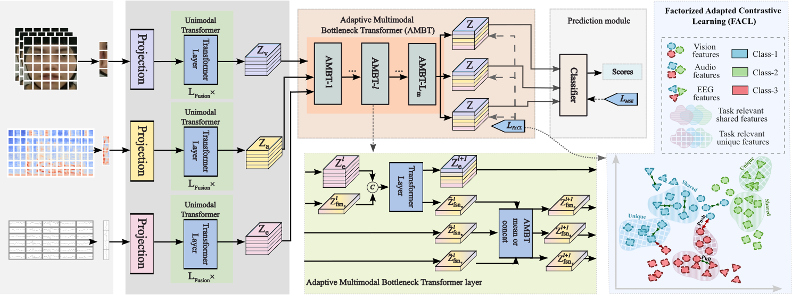
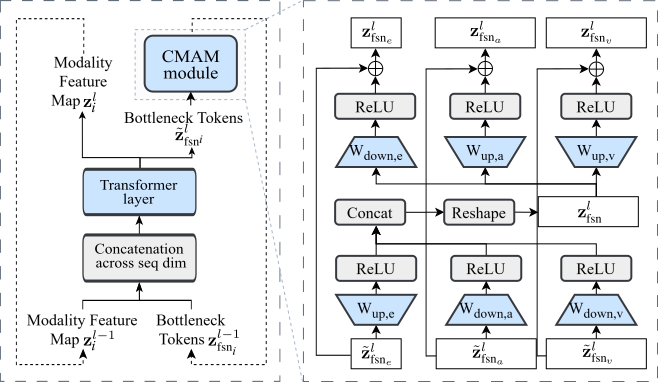

# Adaptive Multimodal Bottleneck Transformer (AMBT)


> **AMBT** is a parameter-efficient multimodal Transformer for **emotion recognition** that fuses **EEG**, **audio**, and **facial video** via **adaptive bottleneck-token interaction** inside intermediate Transformer layers.

---

## ✨ Overview

Facial and speech expressions are strong cues for emotion recognition, while EEG provides complementary neural information when external signals are ambiguous or missing. However, integrating heterogeneous modalities remains challenging due to different sampling rates, feature spaces, and backbone architectures.

**Adaptive Multimodal Bottleneck Transformer (AMBT)** addresses this by introducing **Cross-Modal Adaptation Modules (CMAMs)** that enable controlled and stable cross-modal interaction through bottleneck tokens.

---

## 🧠 Key Ideas

AMBT performs fusion using **adapter-style bottleneck interaction**:

- **Stable fusion** through bottleneck tokens (reduces premature collapse)
- **Preserves unimodal capacity** while enriching representations with cross-modal context
- **Architecture-agnostic integration** across heterogeneous Transformer encoders
- **Parameter-efficient training** (**< 1%** additional trainable parameters)

---

## 🏗️ Method

### Cross-Modal Adaptation Module (CMAM)

CMAM injects multimodal interaction into intermediate Transformer layers using bottleneck tokens shared across modalities.

<p align="center">
  
</p>

> **Figure 1.** Overview of AMBT: unimodal encoders + CMAM adapters with bottleneck tokens enabling cross-modal exchange.

---

### Bottleneck Token Interaction

<p align="center">
  
</p>

> **Figure 2.** CMAM block: bottleneck tokens interact with modality-specific tokens and propagate fused context.

---

## 📊 Results

Evaluated on three benchmark datasets:

| Dataset | Modalities | Accuracy |
|--------|------------|----------|
| **EAV** | EEG + Audio + Video | **85.1%** |
| **CREMA-D** | Audio + Video | **90.9%** |
| **DEAP** | EEG + Video | **98.7%** |

---

## 🔥 Features

- Independent Transformer encoders for EEG, audio, and video
- **CMAM** modules for controlled bottleneck-token fusion
- Parameter-efficient multimodal adaptation (**< 1%** trainable params)
- Unified latent space for fused multimodal representations
- Supports:
  - EEG (DEAP / EAV format)
  - Audio spectrograms (CREMA-D / EAV)
  - Facial video (CREMA-D / DEAP / EAV)
- Modular codebase:
  - `src/models/` – unimodal + fusion models
  - `src/datasets/` – dataset loaders
  - `src/training/` – training & evaluation scripts
  - `src/utils/` – config, logging, metrics, checkpointing, seeding

---

## 📁 Repository Structure

```text
.
├── install.bat
├── run.bat
├── README.md
├── requirements.txt
├── configs
│   ├── cremad.yaml
│   ├── deap.yaml
│   ├── default.yaml
│   └── eav.yaml
├── src
│   ├── datasets
│   │   ├── Crema-D
│   │   │   ├── audio_load.py
│   │   │   └── video_load.py
│   │   ├── DEAP
│   │   │   ├── dataload_eeg.py
│   │   │   └── dataload_vid.py
│   │   └── EAV
│   │       ├── Dataload_audio.py
│   │       ├── Dataload_eeg.py
│   │       ├── Dataload_vision.py
│   │       └── EAV_datasplit.py
│   ├── models
│   │   ├── AMBT_fusion
│   │   │   ├── AMBT_concat.py
│   │   │   ├── AMBT_mean.py
│   │   │   ├── Transformer_Audio_concat.py
│   │   │   ├── Transformer_Audio_mean.py
│   │   │   ├── Transformer_EEG_concat.py
│   │   │   ├── Transformer_EEG_mean.py
│   │   │   ├── Transformer_Video_concat.py
│   │   │   └── Transformer_Video_mean.py
│   │   └── unimodal
│   │       ├── Audio_Transformer
│   │       │   ├── Audio_Transformer_main.py
│   │       │   └── Audio_Transformer_model.py
│   │       ├── EEG_Transformer
│   │       │   ├── eeg_eegnet_transformer.py
│   │       │   └── eeg_shallow_transformer.py
│   │       └── Video_Transformer
│   │           ├── cls_tokens.pth
│   │           ├── position_embeddings.pth
│   │           ├── Video_Transformer_main.py
│   │           └── Video_Transformer_model.py
│   ├── training
│   │   ├── evaluate.py
│   │   └── train.py
│   └── utils
│       ├── checkpoint.py
│       ├── config.py
│       ├── device.py
│       ├── logging.py
│       └── metrics.py
└── tests
    └── test_forward.py
